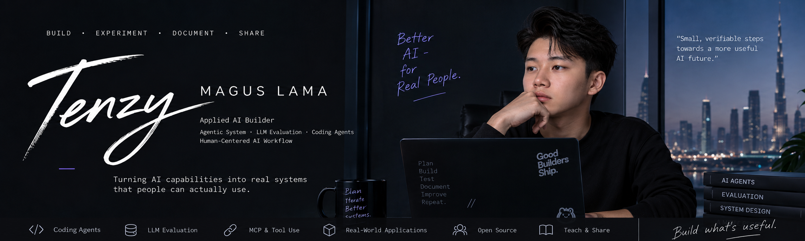

  

## About

I am Tenzy. I build applied AI systems: agent tooling, coding agent infrastructure, and evaluation harnesses.

Most of my work circles one question. When a person and a model are working on the same thing, who is allowed to change what, and what counts as proof that it worked? In my projects that turns into explicit tool contracts, authority boundaries, and status that separates what is designed from what is actually built.

I work mainly in Python and TypeScript. I use coding agents heavily as part of the workflow, not as a way around understanding it.

## Featured Work

### WebMCP Course Planner

A university course planner where a student and an AI agent work on the same live page state. The agent calls two page-registered WebMCP tools, `get_course_plan` and `set_course_plan`, instead of clicking through the interface. The README documents the tool contract, the error behavior for invalid input, and a table of which state the student owns and which the agent can only read.

Built for the OpenAI WebMCP Challenge. TypeScript, React, Vite, MIT licensed.

Repository: [https://github.com/TenzyZ/webmcp-course-planner](https://github.com/TenzyZ/webmcp-course-planner)

Live demo: [https://webmcp-course-planner.vercel.app](https://webmcp-course-planner.vercel.app)

### Evidline

A local-first tool for AI coding agents. It keeps project context and evidence with clear source information, and it checks a proposed change against scope, evidence, freshness, and project rules before that change is treated as accepted project state.

Two ideas drive it. Permission to run a tool is not the same as authorization to change a repository, and executed is not the same as verified. The mutation decision engine is implemented and returns allow, ask, or block along with the reason and the smallest safe next step. Design decisions are recorded as ADRs.

The repository is explicit about its own status. Some parts are built, some are only designed, and no package or release has been published yet.

Python 3.11 or later, zero runtime dependencies, MIT licensed.

Repository: [https://github.com/TenzyZ/Evidline](https://github.com/TenzyZ/Evidline)

### Also public

Three smaller repositories are open while I work on them. They do not have READMEs yet, so treat them as work in progress rather than finished tools.

- gemini-agentic-video: a harness for comparing static and agentic video processing on identical inputs. The methodology is frozen in a contract file before any run. No results are published yet. [https://github.com/TenzyZ/gemini-agentic-video](https://github.com/TenzyZ/gemini-agentic-video)
- RecallGuard: an experiment in keeping repository-specific failures, corrections, and verified fixes available to a coding agent across sessions. [https://github.com/TenzyZ/RecallGuard](https://github.com/TenzyZ/RecallGuard)
- AgentPulse: a small Python CLI for repository hygiene checks and remediation reasoning. [https://github.com/TenzyZ/AgentPulse](https://github.com/TenzyZ/AgentPulse)

## Engineering Focus

- Agentic systems and tool contracts, including MCP and WebMCP
- Coding agent infrastructure: context, evidence, scope, and approval
- LLM evaluation: frozen methodology, reproducible harnesses, honest reporting
- Human and AI collaboration over shared application state
- Python, TypeScript, React, Git and GitHub
- Building alongside Claude Code and OpenAI Codex

## How I Build

- Write down the scope and the boundary before writing code.
- Keep the person in control of anything that changes real state.
- Track what was proposed, what actually ran, and what was verified as three separate things.
- Prefer fresh evidence over recollection. A claim is not a fact until something checks it.
- Say plainly what is built and what is only designed.

## Private Work

I have an ongoing private project called AIRI, a local-first desktop assistant. It is in active development, not a finished system, and there is nothing public to inspect yet. It will show up here when there is.

I am also still closing gaps, mostly deeper Python and systems fundamentals and more rigorous evaluation practice.

## Connect

- LinkedIn: [https://ae.linkedin.com/in/magus-lama-8968a03b5](https://ae.linkedin.com/in/magus-lama-8968a03b5)
- X: [https://x.com/TenzyXzy](https://x.com/TenzyXzy)
