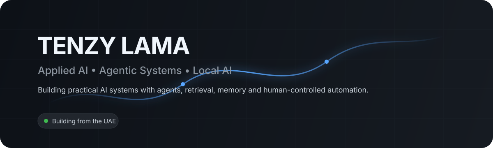

<p align="center">
  
</p>

<p align="center">
  <a href="https://www.linkedin.com/in/magus-lama-8968a03b5/">LinkedIn</a>
  ·
  <a href="https://x.com/TenzyXzy">X</a>
  ·
  <a href="https://github.com/TenzyZ">GitHub</a>
</p>

## About

I’m Tenzy, an early-career applied AI builder focused on turning LLMs into useful systems — not just demos.

My work centers on **agentic workflows, retrieval, memory, local AI, tool use, context management, and human-controlled automation**. I’m also strengthening the software-engineering fundamentals behind those systems so I can understand, build, debug, and evaluate them end to end.

I care about three things in particular: **useful behavior, clear system boundaries, and evidence that a change actually improved the system.**

## Selected Work

<table>
<tr>
<td width="50%" valign="top">

### AIRI
**Local-first desktop AI assistant**

A long-running project exploring how a personal AI assistant can combine conversational intelligence with local execution boundaries, memory, voice, tool use, safety controls, and desktop-oriented workflows.

**Focus:** agents · local-first architecture · memory · voice · tool use · human approval

</td>
<td width="50%" valign="top">

### Vega
**Small local model experimentation**

A disciplined local-model project focused on measuring a base model before changing it, defining target behavior, and building a reproducible path for evaluation and later fine-tuning.

**Focus:** local LLMs · evaluation · Qwen · QLoRA · reproducibility · behavioral testing

</td>
</tr>
</table>

> Some active projects remain private while they are being developed. Public case studies and smaller engineering projects will be added as they are ready.

## AI Engineering Focus

**LLM systems**  
Agents · RAG · context engineering · memory · tool use · prompt design · evaluation

**Engineering foundations**  
Python · APIs · JSON · Git/GitHub · debugging · testing · system design fundamentals

**Local AI & model tooling**  
LM Studio · Qwen · GGUF · Unsloth · QLoRA workflows

**Agent development tooling**  
Claude Code · OpenAI Codex · reusable agent skills · verification workflows · context-budget discipline

## How I Build

```text
Understand the problem
        ↓
Define scope + boundaries
        ↓
Design the smallest useful system
        ↓
Build with AI-assisted engineering workflows
        ↓
Verify behavior and failure cases
        ↓
Document what actually worked
```

I use AI heavily as an engineering tool, but I don’t want it to replace understanding. My current goal is to keep improving the fundamentals underneath the tools: Python, software design, debugging, APIs, data flow, testing, and production-oriented LLM engineering.

## Currently Learning

- Deepening Python and software-engineering fundamentals
- Building stronger intuition for LLM application architecture
- Studying retrieval, memory, context management, and agent reliability
- Learning reproducible evaluation and fine-tuning workflows for smaller local models
- Turning private project experience into clean, reviewable public engineering work

## What I’m Interested In

I’m particularly interested in early-career opportunities around **Applied AI Engineering, Agentic AI, LLM Applications, AI Automation, AI Integrations, and forward-deployed AI work**.

If the work involves making AI systems more useful, reliable, understandable, or controllable, I’ll probably find it interesting.

## Connect

<p>
  <a href="https://www.linkedin.com/in/magus-lama-8968a03b5/">
    
  </a>
  <a href="https://x.com/TenzyXzy">
    
  </a>
  <a href="https://github.com/TenzyZ">
    
  </a>
</p>
